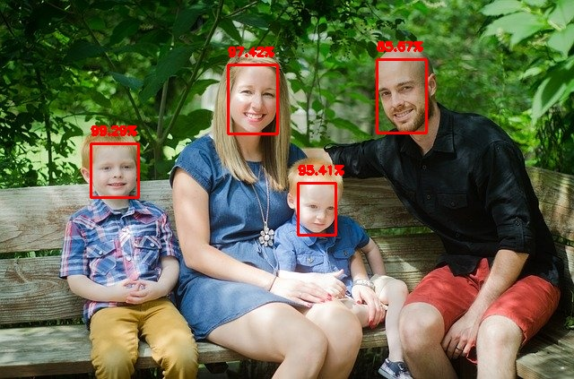

# mask-detection

[](https://lgtm.com/projects/g/vipulrai91/mask-detection/alerts/)

Project on mask detection<br>

This project will be done in multiple stages. Let's start with Phase 1 : Detecting faces

Phase 1 :

The first part is to be familiar with image detection which is subset of object detection

Here we will be using pretrained model on caffe

Image credit : Image by [1138694](https://pixabay.com/users/1138694-1138694/?utm_source=link-attribution&utm_medium=referral&utm_campaign=image&utm_content=1016311) from [Pixabay](https://pixabay.com/?utm_source=link-attribution&utm_medium=referral&utm_campaign=image&utm_content=1016311)

Pretrained model from : [pyimagesearch](https://www.pyimagesearch.com)

To run : Change the python version to the required and run this from home directory

```console
/Users/vipul/opt/anaconda3/envs/ml/bin/python /Users/vipul/Work/Github/mask-detection/app/face_detector/infer_faces.py --image app/face_detector/images/family.jpg  --prototxt app/face_detector/model/deploy.prototxt.txt  --model app/face_detector/model/res10_300x300_ssd_iter_140000.caffemodel  --confidence 0.6
```

The output get's stored in the out directory

Before :


After running through model

After :



The confidence is label on top of the box
